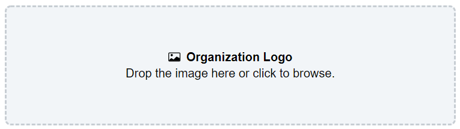
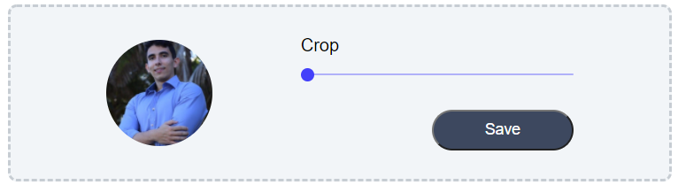
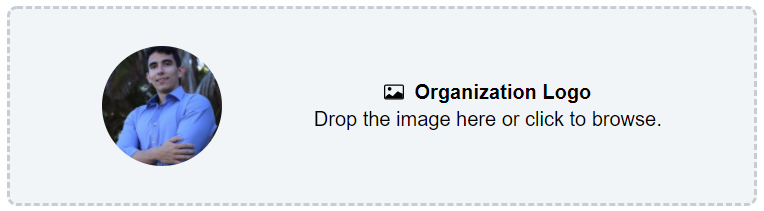

<h1 align="center">Crop Avatar</h1>
<p align="center">Simple Component in nextJS</p>
<p align="center">
  <a href="https://reactjs.org/">
    
  </a>
  <a href="https://nextjs.org/">
    
  </a>
</p>
<p align="center"></p>
<p align="center"></p>
<p align="center"></p>

## Demo

<p>Layout: <a href="https://crop-avatar.jeffersonbrandao.com.br/" target="__blank">Project Link</a></p>

---

## About

A simple Next component using typescript to let users upload and crop avatars.

### Technologies

<ul>
    <li>React</li>
    <li>Next</li>
    <li>Typescript</li>
    <li>react-easy-crop</li>
    <li>SASS</li>
    <li>react-icons</li>
</ul>
<h2>Figma</h2>
<p>Layout: <a href="https://www.figma.com/file/3Ki7sTwdPpxDSDkeVhBMUl/crop-avatar-upload" target="__blank">Project Link</a></p>

## Run Project

Clone Project

```git
git clone https://github.com/jeffersonbraster/avatar_uploader.git
```

Web

```ssh
yarn
yarn dev
```

## Author

Jefferson Brandão - [GitHub](https://github.com/jeffersonbraster) / [Linkedin](https://www.linkedin.com/in/jefferson-brandao-dev/) / [Email](mailto:jeffersonbraster@gmail.com)

## License

This project use MIT license, see the file [LICENSE](./LICENSE.md) for more details

---

<p align="center">Develop by <a href="https://github.com/jeffersonbraster">Jefferson Brandão</a></p>
